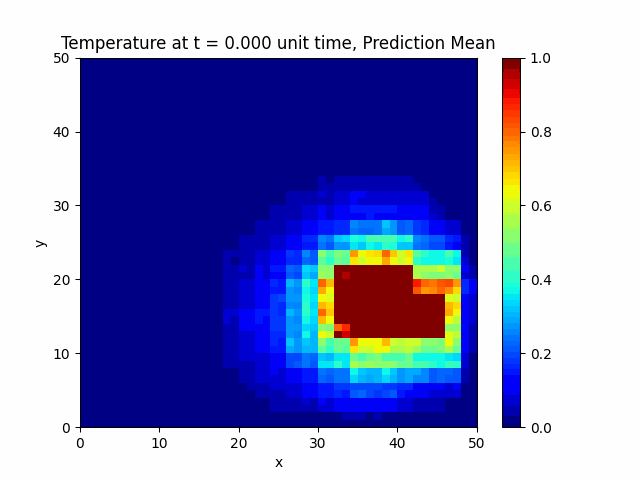
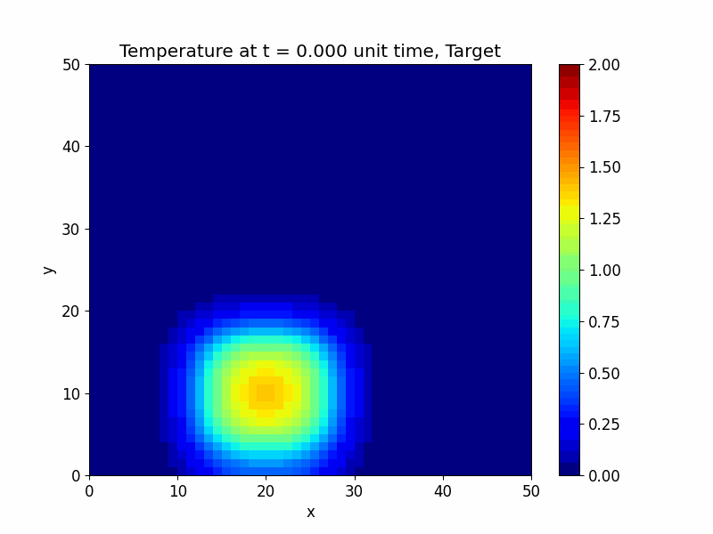

# Neural Processes for Heat Diffusion

[](https://www.python.org/downloads/)
[](https://pytorch.org/)
[](https://opensource.org/licenses/MIT)

A physics-informed Neural Process implementation for modelling 2D heat diffusion, developed as part of a Part III project. This project extends the standard Neural Process architecture with physically-motivated modifications to better capture the dynamics of the heat equation.

<p align="center">
  
</p>

## Overview

This repository implements Neural Processes tailored to solve physical systems, specifically the 2D heat diffusion equation. Three key architectural innovations are explored:

### 1. Convolutional Encoder & Decoder
Exploits spatial equivariance inherent to the heat diffusion equation. Since the governing PDE contains only derivative terms (no spatially-dependent forcing), the solution respects spatial translation invariance—a property naturally captured by convolutional architectures.

### 2. Learning Using Privileged Information (LUPI)
Incorporates additional physics-based features during training that are unavailable at test time. The privileged information includes:
- **Diffusion coefficient** — controls the rate of heat transfer
- **Maximum temperature** — peak value across the grid  
- **Total energy** — integral of temperature over the domain
- **Entropy measure** — distribution uniformity metric

The LUPI encoder produces embeddings that are aggregated with the data embeddings via a residual connection, acting as a "first-order correction" to the learning process.

### 3. Time-Order Respecting Aggregator (Experimental)
Standard Neural Processes use permutation-invariant aggregators, but physical systems often exhibit temporal ordering (e.g., entropy increase). A causal aggregator could enforce that future information does not leak into past predictions.

## Repository Structure

```
.
├── neural-processes/           # Core implementation
│   ├── models.py              # Network architectures (CNN, Encoder, Decoder, etc.)
│   ├── neural_process.py      # NeuralProcess and NeuralProcessConv classes
│   ├── training.py            # Training loop with ELBO loss
│   ├── heat_diffusion_dataset.py  # Heat equation data generation
│   ├── utils.py               # Context-target splitting utilities
│   └── visualise.py           # Plotting functions
├── np_heat_diffusion.ipynb    # Main experiment notebook
├── trainers/                  # Saved model checkpoints
├── metadata/                  # Pre-generated dataset tensors
├── results/                   # Experiment outputs and plots
├── figures/                   # Publication-ready figures
├── animation_results/         # Generated GIF animations
└── GIFs/                      # Additional visualisations
```

## Installation

### Prerequisites
- Python 3.9 or higher
- CUDA-capable GPU (recommended for training)

### Setup

1. **Clone the repository**
   ```bash
   git clone https://github.com/yourusername/part_III_project.git
   cd part_III_project
   ```

2. **Create a virtual environment**
   ```bash
   python -m venv venv
   source venv/bin/activate  # On Windows: venv\Scripts\activate
   ```

3. **Install dependencies**
   ```bash
   pip install -r requirements.txt
   ```

## Dependencies

```
torch>=2.0.0
numpy>=1.21.0
scipy>=1.7.0
matplotlib>=3.5.0
pandas>=1.3.0
torchvision>=0.15.0
jupyter>=1.0.0
```

## Quick Start

### 1. Generate Training Data

The `Diffusion_Data` class generates synthetic heat diffusion trajectories by solving the 2D heat equation with Neumann boundary conditions:

```python
from neural_processes.heat_diffusion_dataset import Initial_Conditions, Diffusion_Data

initial_conditions = Initial_Conditions(max_iter_time=100, grid_size=50)

dataset = Diffusion_Data(
    num_samples=40,
    max_iter_time=100,
    grid_size=50,
    initial_conditions=initial_conditions,
    square_range=(5, 10),      # Random initial hot-spot size
    temp_range=(0.7, 1.0),     # Random initial temperature
    diffusion_coef=0.5,
    sigma=3                    # Gaussian smoothing for stability
)
```

### 2. Train the Neural Process

```python
from neural_processes.neural_process import NeuralProcess, NeuralProcessConv
from neural_processes.training import NeuralProcessTrainer
import torch

# Define model dimensions
dimensions = {
    "t_dim": 1,          # Time input dimension
    "y_dim": 2500,       # Grid size (50x50)
    "r_dim": 128,        # Representation dimension
    "z_dim": 128,        # Latent dimension  
    "h_dim": 256,        # Hidden layer dimension
    "pi_dim": 4,         # Privileged info dimension
    "grid_size": 50,
    "num_channels": 8
}

# Instantiate model
model = NeuralProcess(dimensions)
optimizer = torch.optim.Adam(model.parameters(), lr=1e-4)

# Create trainer
trainer = NeuralProcessTrainer(
    device=torch.device("cuda" if torch.cuda.is_available() else "cpu"),
    neural_process=model,
    optimizer=optimizer,
    num_context_range=(10, 50),
    num_extra_target_range=(10, 50),
    is_lupi=True  # Enable privileged information
)

# Train
data_loader = DataLoader(dataset, batch_size=1, shuffle=True)
trainer.train(data_loader, epochs=100)
```

### 3. Make Predictions

```python
model.eval()
with torch.no_grad():
    # Provide context points
    x_context = ...  # Shape: (batch, num_context, 1)
    y_context = ...  # Shape: (batch, num_context, 2500)
    x_target = ...   # Shape: (batch, num_target, 1)
    
    # Get predictive distribution
    p_y_pred = model(x_context, y_context, x_target)
    
    # Sample predictions
    mean = p_y_pred.loc           # Predictive mean
    std = p_y_pred.scale          # Predictive uncertainty
```

## Experiments

The main experiments are documented in `np_heat_diffusion.ipynb`, which includes:

1. **Baseline Neural Process** — Standard architecture without physics-informed modifications
2. **Convolutional Neural Process** — With CNN-based encoder/decoder
3. **LUPI Neural Process** — With privileged information during training

### Running the Notebook

```bash
jupyter notebook np_heat_diffusion.ipynb
```

## Results

### Model Comparison

| Model | Test Log-Likelihood | Training Time |
|-------|-------------------|---------------|
| Baseline NP | — | — |
| Conv NP | — | — |
| LUPI NP | — | — |

### Visualisations

The trained models produce mean predictions and calibrated uncertainty estimates:

| Target | Prediction (Mean) | Uncertainty (Variance) |
|--------|------------------|----------------------|
|  |  |  |

## Pre-trained Models

Pre-trained model checkpoints are available in the `trainers/` directory:

- `neuralprocess_dict` — Baseline flat encoder
- `neuralprocess_pi_dict` — With LUPI
- `conv_neuralprocess_dict` — Convolutional architecture

Load a checkpoint:
```python
model.load_state_dict(torch.load("trainers/conv_neuralprocess_dict"))
```

## Pre-generated Data

To ensure reproducibility, pre-generated dataset tensors are stored in `metadata/`:

```python
from neural_processes.heat_diffusion_dataset import RestoredData

dataset = RestoredData(
    num_samples=40,
    max_iter_time=100,
    grid_size=50,
    temp_range=(0.7, 1.0)
)
```

## Citation

If you use this code in your research, please cite:

```bibtex
@misc{king2026neuralheat,
  author = {King, Alex},
  title = {Neural Processes for Heat Diffusion},
  year = {2026},
  publisher = {GitHub},
  url = {https://github.com/yourusername/part_III_project}
}
```

## Acknowledgements

- Neural Process implementation inspired by [Emilien Dupont's neural-processes](https://github.com/EmilienDupworking/neural-processes)
- Based on the papers:
  - Garnelo et al., "Neural Processes" (ICML 2018)
  - Garnelo et al., "Conditional Neural Processes" (ICML 2018)
  - Le et al., "Empirical Evaluation of Neural Process Objectives" (NeurIPS 2018 Workshop)

## License

This project is licensed under the MIT License — see the [LICENSE](LICENSE) file for details.

---

<p align="center">
  <i>Developed as part of the Part III Mathematics Tripos, University of Cambridge</i>
</p>
